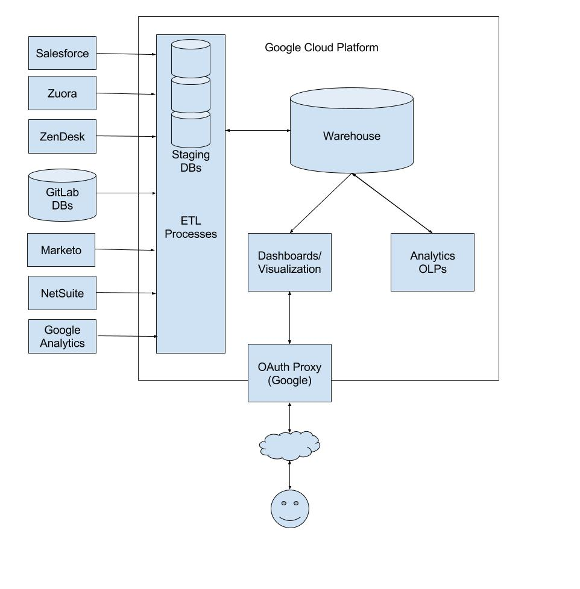

[](https://gitlab.com/meltano/analytics/commits/master)

## Quick Links
* Meltano Repo - https://gitlab.com/meltano/meltano/
* Looker Instance - https://gitlab.looker.com
* Looker Repo - https://gitlab.com/meltano/looker/
* JupyterHub Link - https://hub.gitlab-bizops.com/hub/home
* Snowflake Web UI - https://gitlab.snowflakecomputing.com
* [Machine Learning Resources](https://drive.google.com/drive/folders/1sOXWW-FujwKU2T-auG7KPR9h6xqDRx0z?usp=sharing) (GitLab Internal)
* [Email Address to Share Sheetloaded Doc with](https://docs.google.com/document/d/1m8kky3DPv2yvH63W4NDYFURrhUwRiMKHI-himxn1r7k/edit?usp=sharing) (GitLab Internal)

## Data and Analytics at GitLab

This is the primary repository of the Data & Analytics team at GitLab. We are hosting it within the [Meltano group](https://gitlab.com/meltano/) because we have a close relationship with them: we are the first customers of Meltano and find it valuable to be close, while still keeping the code bases separate. 

The Data & Analytics team is a part of the Finance organization within GitLab, but we serve the entire company. We do this by maintaining a data warehouse where information from all business operations is stored and managed for analysis.

Our charter and goals are as follows:

* Build a centralized data warehouse that can support data analysis requirements from all functional groups within the company.
* Create a common data framework and governance practice.
* Establish the single source of truth for company metrics.
* Establish a change management processes for source systems.
* Develop a Data Architecture plan (in conjunction with functional teams).
* Develop a roadmap for systems evolution in alignment with the Company’s data architecture plan.

## Principles

The Data & Analytics team at GitLab is working to establish a world-class analytics function by utilizing the tools of DevOps in combination with the core values of GitLab. We believe that data teams have much to learn from DevOps. We will work to model good software development best practices and integrate them into our data management and analytics. 

A typical data team has members who fall along a spectrum of skills and focus. For now, the analytics function at GitLab has Data Engineers, Data Analysts, and eventually Data Scientists. 

Data Engineers on our team are essentially software engineers who have a particular focus on data movement and orchestration. The transition to DevOps is typically easier for them because much of their work is done using the command line and scripting languages such as Bash and Python. One challenge in particular are data pipelines. Most pipelines are not well tested, data movement is not typically idempotent, and auditability of history is challenging. 

Data Analysts are further from DevOps practices than Data Engineers. Most analysts use SQL for their analytics and queries, with Python or R a close second. In the past, data queries and transformations may have been done by custom tooling or software written by other companies. These tools and approaches share similar traits in that they're likely not version controlled, there are probably few tests around them, and they are difficult to maintain at scale. 

Data Scientists are probably furthest from integrating DevOps practices into their work. Much of their work is done in tools like Jupyter Notebooks or R Studio. Those who do machine learning create models that are not typically version controlled. Data management and accessibility is also a concern as well. 

We will work closely with the Meltano team and the broader analytics community to find solutions to these challenges. Some of the solutions may be cultural in nature, and we aim to be a model for other organizations of how a world-class Data and Analytics team can utilize the best of DevOps for all Data Operations.

Some of our beliefs are:

* Everything can and should be defined in code.
* Everything can and should be version controlled.
* Data Engineers, Data Analysts, and Data Scientists can and should integrate best practices from DevOps into their workflow.
* It is possible to serve the business while having a high-quality, maintainable code base.
* Analytics, and the code that supports it, can and should be open source.
* There can be a single source of truth for every analytic question within a company.
* Data team managers serve their team and not themselves.

## Priorities

Like the rest of the company, we set quarterly objectives and key results. These are available on our company OKR page.

## Media
* [Tom Cooney explains Zendesk](https://drive.google.com/open?id=1oExE1ZM5IkXcq1hJIPouxlXSiafhRRua) (GitLab internal)

* [Luca Williams explains Customer Success Dashboards](https://drive.google.com/open?id=1FsgvELNmQ0ADEC1hFEKhWNA1OnH-INOJ) (GitLab internal)

* [Art Nasser explains Netsuite and Campaign Data](https://drive.google.com/open?id=1KUMa8zICI9_jQDqdyN7mGSWSLdw97h5-) (GitLab internal)

* [Courtland Smith explains Marketing Dashboard needs](https://drive.google.com/open?id=1bjKWRdfUgcn0GfyB2rS3qdr_8nbRYAZu) (GitLab internal)

* [Taylor explains dbt](https://drive.google.com/open?id=1ZuieqqejDd2HkvhEZeOPd6f2Vd5JWyUn) (GitLab internal)

* [dbt docs intro with Drew Banin from Fishtown Analytics](https://www.youtube.com/watch?v=bqIBNvA9xjo)

* [Looker Customer Success team shares how the Looker at Looker](https://drive.google.com/file/d/1w__Jqh9UKliPdQNNcd3KpQfp93Q1SuJb/view?usp=sharing)

* Taylor's talk at the 2018 Nashville Analytics Summit - Coming Soon

* [How Data Teams Do More With Less By Adopting Software Engineering Best Practices - Thomas's talk at the 2018 DataEngConf in NYC](https://www.youtube.com/watch?v=eu623QBwakc)

* GitLab blog post about Meltano - https://news.ycombinator.com/item?id=17667399
  * Livestream chat with Sid and HN user slap_shot - https://www.youtube.com/watch?v=F8tEDq3K_pE
  * Follow-up blog post to original Meltano post - https://about.gitlab.com/2018/08/07/meltano-follow-up/

## Recommended Reading, Listening, Watching

* [The AI Hierarchy of Needs](https://hackernoon.com/the-ai-hierarchy-of-needs-18f111fcc007)
* [Data Meta Metrics](https://caitlinhudon.com/2017/11/14/data-meta-metrics/)
* [Engineers Shouldn’t Write ETL](https://multithreaded.stitchfix.com/blog/2016/03/16/engineers-shouldnt-write-etl/)
* [The Startup Founder’s Guide to Analytics](https://thinkgrowth.org/the-startup-founders-guide-to-analytics-1d2176f20ac1)
* [Functional Data Engineering — a modern paradigm for batch data processing](https://medium.com/@maximebeauchemin/functional-data-engineering-a-modern-paradigm-for-batch-data-processing-2327ec32c42a)
* [Keep it SQL Stupid, a talk by Connor McArthur of Fishtown Analytics at DataEngConf SF '18 explaining dbt](https://www.youtube.com/watch?v=9VNh11qSfAo)
* [Views on Vue Podcast with Jacob Schatz and Taylor Murphy](https://devchat.tv/views-on-vue/vov-030-how-we-use-vue-in-data-science-with-jacob-schatz-taylor-murphy-gitlab-team/)
* [Pain Points by the Airflow Podcast with @tlapiana](https://soundcloud.com/the-airflow-podcast/pain-points)
* [DevOps for AI](https://www.youtube.com/watch?v=HwZlGQuCTj4)
* [What Can Data Scientists Learn from DevOps](https://redmonk.com/dberkholz/2012/11/06/what-can-data-scientists-learn-from-devops/)
* [One Analyst's Guide for Going from Good to Great](https://blog.fishtownanalytics.com/one-analysts-guide-for-going-from-good-to-great-6697e67e37d9)
* The Value of Data: [Part 1](https://www.codingvc.com/the-value-of-data-part-1-using-data-as-a-competitive-advantage), [Part 2](https://www.codingvc.com/the-value-of-data-part-2-building-valuable-datasets), [Part 3](https://www.codingvc.com/the-value-of-data-part-3-data-business-models)
* [Building a Data Practice](https://www.locallyoptimistic.com/post/building-a-data-practice/)
* [Does my Startup Data Team Need a Data Engineer](https://blog.fishtownanalytics.com/does-my-startup-data-team-need-a-data-engineer-b6f4d68d7da9)


## Data sources

Current as of 2018-Q3:

* Clearbit
* DiscoverOrg
* GitLab.com Database
* Internal Google Sheets
* Lever
* Marketo
* Netsuite
* Salesforce
* Snowplow Events
* Stripe
* Usage/Version Pings
* Zendesk
* Zuora

Planned:

* AWS Billing
* BambooHR
* Fastly Billing
* GCP Billing
* Greenhouse


### Data and Analytics Architecture



#### Our Stack

We use GitLab to operate and manage the analytics function. Everything starts with an issue. Changes are implemented via merge requests, including changes to our pipelines, extraction, loading, transformations, and parts of our analytics.

|Stage|Tool|
|:-|:-:|
|Extraction|Stitch and Meltano|
|Loading|Stitch and Meltano|
|Orchestration|GitLab CI|
|Storage|Cloud SQL (PostgreSQL) and Snowflake|
|Transformations|dbt and Python scripts|
|Analysis|Python and Looker|

## Documentation

### Extractors

#### Stitch

We are loading multiple data sources through Stitch:
*  Marketo - 12 hour intervals - Backfilled from January 1, 2013
*  Netsuite - 30 minute intervals - Backfilled from January 1, 2013
*  SFDC - 1 hour intervals - Backfilled from January 1, 2013
*  Zendesk - 1 hour intervals - Backfilled from January 1, 2013
*  Zuora - 30 minute intervals - Backfilled from January 1, 2013

### Storage

#### Snowflake
Snowflake is a cloud data warehouse. It separates storage from compute making it easy to scale analytics up and down as needed.

#### Managing Roles for Snowflake

Here are the proper steps for provisioning a new use and user role:

* Login and switch to securityadmin role
* Create user (`EBURKE`)
  * Create a password using https://passwordsgenerator.net/
  * Click next and fill in additional info. Make Login Name and Display name match user name (all caps).
  * Do not set any defaults.
  * Send to person using https://onetimesecret.com/
* Create role for user (`EBURKE` for example) with SYSADMIN as the parent role (this grants the role to sysadmin)
* Grant user role to new user
* Create user_scratch schema in ANALYTICS as SYSADMIN
  * CREATE SCHEMA eburke_scratch;
* Grant ownership of scratch schema to user role
  * GRANT OWNERSHIP ON schema eburke_scratch TO ROLE eburke;
* Document in Snowflake config.yml permissions file

##### Project variables

Our current implementation uses the following project variables:

  - SNOWFLAKE_ACCOUNT
  - SNOWFLAKE_REPORT_WAREHOUSE
  - SNOWFLAKE_{FLAVOR}_USER
  - SNOWFLAKE_{FLAVOR}_PASSWORD
  - SNOWFLAKE_{FLAVOR}_DATABASE
  - SNOWFLAKE_{FLAVOR}_ROLE
  - SNOWFLAKE_{FLAVOR}_WAREHOUSE
  
The following flavors are defined:

  - `LOAD` flavor is used by the Extract & Load process
  - `TRANSFORM` flavor is used by the Transform process
  - `TEST` flavor for testing using Snowflake
  - `PERMISSION` flavor for the permission bot
  - `SYSADMIN` flavor for housekeeping tasks (like setting up review instances). This flavor doesn't define `SNOWFLAKE_SYSADMIN_DATABASE` and `SNOWFLAKE_SYSADMIN_WAREHOUSE`.

<div class="panel panel-warning">
The following variables are set at the job level dependending on the running environment **and should not set in the project settings**.
{: .panel-heading}
<div class="panel-body">
  - SNOWFLAKE_USER
  - SNOWFLAKE_PASSWORD
  - SNOWFLAKE_ROLE
  - SNOWFLAKE_DATABASE
  - SNOWFLAKE_WAREHOUSE
</div>
</div>


#### Google Cloud SQL

[Cloud SQL](https://cloud.google.com/sql/docs/postgres/) - is a fully-managed database service that makes it easy to set up, maintain, manage, and administer GitLab's PostgreSQL relational databases on Google Cloud Platform.

#### Accessing the Data Warehouse
If you want direct access to the data warehouse (outside of Looker or JupyterHub), follow these steps.

* Make an issue is this project requesting an account and assign it to either Taylor Murphy (tayloramurphy) or Thomas La Piana (tlapiana).
* Verify your Google account is associated with the `gitlab-analysis` project, it should have the `Cloud SQL Client` role.
* Set up your local machine by installing the [gcloud SDK](https://cloud.google.com/sdk/docs/).
* Run `gcloud config set project gitlab-analysis`
* Run `gcloud auth application-default login`
* CloudSQL Instances: `analytics` is the master production node, `analytics-replica` is the production read-replica, `meltano` is the nightly refreshed dev instance
* Connect to cloudsqlproxy `./cloud_sql_proxy -instances=gitlab-analysis:us-west1:<instance_name>=tcp:5432`
* Connect to the Data Warehouse through the terminal (a separate tab) with `psql "host=127.0.0.1 sslmode=disable dbname=dw_production user=<username>`
* Alternatively, use your favorite database tool with `host=127.0.0.1` and `dbname=dw_production`

#### Managing Roles for CloudSQL

All role definitions are in [/extract/config/pg_roles/](https://gitlab.com/meltano/meltano/tree/master/extract/config)

Ideally we'd be using [pgbedrock](https://github.com/Squarespace/pgbedrock) to manage users. Since internally we are using CloudSQL, we're not able to access the superuser role which pgbedrock requires. However, the YAML format of the role definitions is convenient for reasoning about privileges and it's possible the tool could evolve to validate privileges against a given spec, so we are using the pgbedrock definition syntax to define roles here. 

The `readonly` role was generated using the following commands:

```sql
CREATE ROLE readonly;

GRANT USAGE on SCHEMA analytics, analytics_meta, customers, historical, lever, license, meta, mkto, public, sandbox, sfdc, sfdc_derived, version, zuora, stripe_about_gitlab, stripe_githost to readonly;

GRANT SELECT on ALL TABLES IN SCHEMA analytics, analytics_meta, customers, historical, lever, license, meta, mkto, public, sandbox, sfdc, sfdc_derived, version, zuora, stripe_about_gitlab, stripe_githost to readonly;

-- Ensures all future tables are available to the role
ALTER DEFAULT PRIVILEGES IN SCHEMA analytics, analytics_meta, customers, historical, lever, license, meta, mkto, public, sandbox, sfdc, sfdc_derived, version, zuora, stripe_about_gitlab, stripe_githost 
  GRANT SELECT ON TABLES TO readonly;

GRANT ALL PRIVILEGES ON ALL TABLES IN SCHEMA sandbox TO readonly;
GRANT ALL PRIVILEGES ON ALL TABLES IN SCHEMA meta TO readonly;

```

The `analytics` role was generated using the following commands:

```sql

CREATE ROLE analytics;

GRANT USAGE on SCHEMA analytics, analytics_meta, customers, historical, lever, license, meta, mkto, public, sandbox, sfdc, sfdc_derived, version, zuora, stripe_about_gitlab, stripe_githost to analytics;

GRANT SELECT on ALL TABLES IN SCHEMA analytics, analytics_meta, customers, historical, lever, license, meta, mkto, public, sandbox, sfdc, sfdc_derived, version, zuora, stripe_about_gitlab, stripe_githost to analytics;

-- Ensures all future tables are available to the role
ALTER DEFAULT PRIVILEGES IN SCHEMA analytics, analytics_meta, customers, historical, lever, license, meta, mkto, public, sandbox, sfdc, sfdc_derived, version, zuora, stripe_about_gitlab, stripe_githost
  GRANT SELECT ON TABLES TO analytics;

GRANT ALL PRIVILEGES ON ALL TABLES IN SCHEMA analytics, analytics_meta, meta, public, sandbox TO analytics;

GRANT CREATE on DATABASE dw_production to analytics;

``` 

New user roles are added to a specific role via:

```sql
CREATE ROLE newrole WITH PASSWORD 'tmppassword' IN ROLE metarole;

ALTER ROLE newrole WITH LOGIN;

-- create a scratch schema for the user if necessary
CREATE SCHEMA newrole_scratch AUTHORIZATION newrole;
```

New readonly and analytics users are then given instructions via Google Drive on how to connect their computer to the CloudSQL Proxy and on how to change their password once they login.

By default, roles can login to the main production instance of the data warehouse. Any password updates will propagate to `dev-bizops` and review instances when they are next refreshed.

Both readonly and analytics roles are not able to alter data in load only schemas. Currently, analytics, public, and sandbox are the only schemas which the `analytics` role can fully manipulate. Both roles have the ability to select from all schemas and tables. 

### Accessing peered VPCs

Some of the GitLab specific ELTs connect to databases which are in peered GCP projects, such as the usage ping. To allow connections, a few actions have been taken:
1. The Kubernetes cluster where the runner executes has been setup to use [IP aliasing](https://cloud.google.com/kubernetes-engine/docs/how-to/ip-aliases), so each pod gets a real routable IP within GCP.
1. A [VPC peering relationship](https://cloud.google.com/vpc/docs/vpc-peering) has been established between the two projects and their networks.
1. A firewall rule has been created in the upstream project to allow access from the runner Kubernetes cluster's pod subnet.

### Transformations

#### Hosts Records Dataflow

From our on-premises installations, we recieve [version and ping information](https://docs.gitlab.com/ee/user/admin_area/settings/usage_statistics.html) from the software. This data is currently imported once a day from a PostgreSQL database into our enterprise data warehouse (EDW). We use this data to feed into Salesforce (SFDC) to aid our sales representatives in their work.

The domains from all of the pings are first cleaned by standardizing the URL using a package called [tldextract](https://github.com/john-kurkowski/tldextract). Each cleaned ping type is combined into a single host record. We make a best effort attempt to align the pings from the same install of the software. 

This single host record is then enriched with data from three sources: DiscoverOrg, Clearbit, and WHOIS. If DiscoverOrg has no record of the domain we then fallback to Clearbit, with WHOIS being a last resort. Each request to DiscoverOrg and Clearbit is cached in the database and is updated no more than every 30 days. The cleaning and enrichment steps are all accomplished using Python.

We then take all of the cleaned records and use dbt to make multiple transformations. The last 60 days of pings are aligned with Salesforce accounts using the account name or the account website. Based on this, tables are generated of host records to upload to SFDC. If no accounts are found, we then generate a table of accounts to create within SFDC. 

Finally, we use Python to generate SFDC accounts and to upload the host records to the appropriate SFDC account. We also generate any accounts necessary and update any SFDC accounts with DiscoverOrg, Clearbit, and WHOIS data if any of the relevant fields are not already present in SFDC.

#### dbt

At Gitlab we use dbt (data build tool) for data transformation. What follows are the conventions we use internally. *Inspired by [Fishtown Analytics](https://github.com/fishtown-analytics/corp/blob/master/dbt_coding_conventions.md)*

#### Useful Links
- Watch [this video (GitLab internal)](https://drive.google.com/open?id=1ZuieqqejDd2HkvhEZeOPd6f2Vd5JWyUn) on how to use dbt
- Use dbt for as much modeling as possible - see this [blog post](https://blog.fishtownanalytics.com/how-do-you-decide-what-to-model-in-dbt-vs-lookml-dca4c79e2304) from Fishtown Analytics.


##### Policy & Procedure

- Reviewers should have 48 hours to complete a review, so plan ahead with the end of your sprint.
- When possible, questions/problems should be discussed with your reviewer before MR time. MR time is by definition the worst possible time to have to make meaningful changes to your models, because you’ve already done all of the work!

##### Model Configuration

- Model-specific attributes (like sort/dist keys) should be specified in the model.
- If a particular configuration applies to all models in a directory, it should be specified in the project.
- In-model configurations should be specified like this:

```python
{{
  config(
    materialized = ’table’,
    sort = ’id’,
    dist = ’id’
  )
}}
```

##### Base Models

- Only base models should select from source tables / views.
- Only a single base model should be able to select from a given source table / view.
- Base models should be placed in a `base/` directory.
- Base models should perform all necessary data type casting.
- Base models should perform all field naming to force field names to conform to standard field naming conventions.
- Source fields that use reserved words must be renamed in base models.

##### Field Naming Conventions

- TBD

##### CTEs (Common Table Expressions)

- All `{{ ref('...') }}` statements should be placed in CTEs at the top of the file.
- Where performance permits, CTEs should perform a single, logical unit of work.
- CTE names should be as verbose as needed to convey what they do.
- CTEs with confusing or noteable logic should be commented.
- CTEs that are duplicated across models should be pulled out into their own models.
- CTEs should be formatted like this:

``` sql
WITH events AS (

  ...

),

-- CTE comments go here
filtered_events AS (

  ...

)

SELECT * 
FROM filtered_events
```

##### Style Guide

- Indents should be four spaces (except for predicates, which should line up with the `where` keyword).
- Lines of SQL should be no longer than 80 characters.
- Field names should all be lowercased.
- Function names should all be capitalized.
- The `as` keyword should be used when projecting a field or table name.
- Fields should be stated before aggregates / window functions.
- Ordering and grouping by a number (eg. group by 1, 2) is ok.
- When possible, take advantage of `using` in joins.
- Prefer `union all` to `union` [*](http://docs.aws.amazon.com/redshift/latest/dg/c_example_unionall_query.html).
- *DO NOT OPTIMIZE FOR A SMALLER NUMBER OF LINES OF CODE. NEWLINES ARE CHEAP, BRAIN TIME IS EXPENSIVE*

##### Example Code
```sql
with my_data as (

    SELECT * 
    FROM {{ ref('my_data') }}

),

some_cte as (

    SELECT * 
    FROM {{ ref('some_cte') }}

)

SELECT [distinct]
    field_1,
    field_2,
    field_3,
    CASE
        WHEN cancellation_date is null and expiration_date is not null then expiration_date
        WHEN cancellation_date is null then start_date+7
        ELSE cancellation_date
    END AS canellation_date

    SUM(field_4),
    MAX(field_5)

FROM my_data
JOIN some_cte USING (id)

WHERE field_1 = ‘abc’
  AND (
    field_2 = ‘def’ OR
    field_2 = ‘ghi’
  )

GROUP BY 1, 2, 3
HAVING count(*) > 1
```

##### Data Grip Configuration

You can change your formatting preferences in Data Grip by going to Preferences > Editor > Code Style > HTML.
You should have:

* Use tab character: unchecked
* Tab size: 4
* Indent: 4
* Continuation indent: 8
* Keep indents on empty lines: unchecked

You can use `Command + Option + L` to format your file.

##### Testing

- Every model should be tested in a `schema.yml` file
- At minimum, unique, not nullable fields, and foreign key constraints should be tested (if applicable)
- The output of dbt test should be pasted into MRs
- Any failing tests should be fixed or explained prior to requesting a review

### Analysis

#### Looker

We use Looker as our analysis and visualization tool. Please see the README in the [looker project](https://gitlab.com/meltano/looker/) for more information.

#### JupyterHub

[JupyterHub](https://jupyterhub.readthedocs.io/en/latest/) - a multi-user Hub that spawns, manages, and proxies multiple instances of the single-user Jupyter notebook server. The Jupyter Notebook is an open-source web application that allows you to create and share documents that contain live code, equations, visualizations and explanatory text.

#### Data Resources
- [Looker Documentation](https://docs.looker.com)
- [Fishtown Analytics Blog](https://blog.fishtownanalytics.com)
- [Data Science Roundup Newsletter](http://roundup.fishtownanalytics.com/)
- [Mode Analytics Blog](https://blog.modeanalytics.com/)
- [Looker Blog](https://looker.com/blog)
- [Periscope Data Blog](https://www.periscopedata.com/blog)
- [Yhat Blog](http://blog.yhat.com/)
- [Wes McKinney Blog](http://wesmckinney.com/archives.html)
- [MBA Mondays](https://avc.com/archive/#mba_mondays_archive)


#### Data Visualization Resources
- [Storytelling with Data](http://storytellingwithdata.com/)
- [Eager Eyes](https://eagereyes.org/)
- [FiveThirtyEight's DataLab](https://fivethirtyeight.com/features/)
- [Flowing Data](https://flowingdata.com/)
- [The Functional Art](http://www.thefunctionalart.com/)
- [PolicyViz](https://policyviz.com/)
- [JunkCharts](https://junkcharts.typepad.com/)
- [Make a Powerful Point](http://makeapowerfulpoint.com/)
- [Perceptual Edge](https://perceptualedge.com/)
- [VizWiz](http://www.vizwiz.com/)
- [Visualising Data](http://www.visualisingdata.com/)
- [WTF Visualizations](http://viz.wtf/)


## Contributing to Data & Analytics

We welcome contributions and improvements, please see the [contribution guidelines](CONTRIBUTING.md).


## License

This code is distributed under the MIT license, see the [LICENSE](LICENSE) file.
